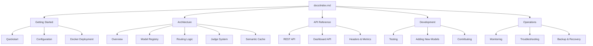

# Documentation Fix and Reorganization

## Issue Overview
The SentinelRouter project currently has documentation scattered across multiple top‑level markdown files, some of which are outdated, inconsistent with the implemented code, or lack a clear hierarchical structure. This issue outlines the necessary fixes and proposes a new documentation architecture to improve clarity, maintainability, and developer onboarding.

## Current Documentation State
As of December 2025, the project contains **38 documentation files** at the top level, covering:

- **Architecture & Design** (e.g., `sentinelrouter_design.md`, `MODEL_CONFIG_ARCHITECTURE.md`, `BACKUP_JUDGES_ARCHITECTURE.md`)
- **Feature Specifications** (e.g., `JUDGE_MODE_OPTIMIZATION.md`, `METRICS_IMPLEMENTATION.md`)
- **Testing & Verification** (e.g., `TEST_COVERAGE.md`, `FEATURE_TEST_PLAN.md`)
- **Post‑Mortems & Summaries** (e.g., `FIX_SUMMARY_UNBOUNDLOCALERROR.md`, `GEMINI_FREE_TIER_RESULTS.md`)

Many of these documents are **critically outdated** because the underlying code has evolved (e.g., judge models changed from DeepSeek/Anthropic to Gemini‑based), while others are **redundant or historical**. The absence of a central navigation point makes it difficult for developers to find the correct, up‑to‑date information.

## Proposed Documentation Structure

```
docs/
├── index.md                          # Main documentation hub
├── getting‑started/
│   ├── quickstart.md                 # Installation & first run
│   ├── configuration.md              # Environment variables, config schema
│   └── docker‑deployment.md          # Production deployment with Docker
├── architecture/
│   ├── overview.md                   # High‑level system diagram and concepts
│   ├── model‑registry.md             # Model configuration & state management
│   ├── routing‑logic.md              # Detailed flow of the four modules (A‑D)
│   ├── judge‑system.md               # Judge architecture (Gemini‑based backup judges)
│   └── semantic‑cache.md             # Cache‑based routing and confidence
├── api‑reference/
│   ├── rest‑api.md                   # `/v1/chat/completions` endpoint
│   ├── dashboard‑api.md              # Enhanced dashboard endpoints
│   └── headers‑and‑metrics.md        # Custom headers & Prometheus metrics
├── development/
│   ├── testing.md                    # Running tests, writing new tests
│   ├── adding‑new‑models.md          # How to integrate a new LLM provider
│   └── contributing.md               # Contribution guidelines
└── operations/
    ├── monitoring.md                 # Dashboard, logs, health checks
    ├── troubleshooting.md            # Common errors and solutions
    └── backup‑and‑recovery.md        # Data persistence, disaster recovery
```

### Root Main Document
A new `docs/index.md` will serve as the entry point, providing:

1. **Project Overview** – What SentinelRouter does and why it exists.
2. **Quick Links** – Direct pointers to the most frequently needed guides.
3. **Documentation Map** – A visual graph of how documents relate (see below).
4. **Version Notice** – Clearly indicate which version of the code the documentation matches.

### Documentation Graph (Conceptual)


## Specific Documentation Fixes Required

### 1. MODEL_CONFIG_ARCHITECTURE.md
**Current Location:** `MODEL_CONFIG_ARCHITECTURE.md` (top‑level)  
**Target Location:** `docs/architecture/model‑registry.md`  
**Inconsistencies to Fix:**

| Documentation Claim | Actual Implementation |
|----------------------|-----------------------|
| Field names in `camelCase` (`modelKey`, `displayName`) | Fields are `snake_case` (`model_key`, `display_name`) |
| `CostInfo` structure with `per_call`, `input_per_million`, `output_per_million` | `PricingInfo` with `input_cost_per_m`, `output_cost_per_m` and optional `usage_tiers` |
| Status values: `ACTIVE`, `INACTIVE` | Status values: `ACTIVE`, `BANNED` |
| `ModelRegistry` class with `register_model()`, `get_next_model()` | Configuration managed by `StateManager`; routing uses priority groups and order lists |
| `freeTierLimits` / `paidTierLimits` as plain objects | Nested `UsageLimits` Pydantic model with validation |
| Judge models: DeepSeek/Anthropic | Judge models: Gemini‑based (Gemini 2.5 Flash Lite, etc.) |

**Action:**  
- Rewrite the document to reflect the actual Pydantic schemas in `sentinelrouter/schemas/config_models.py`.  
- Update examples to match the current `config/models_config.json` structure.  
- Remove references to the deprecated `ModelRegistry` pattern and explain the `StateManager`‑based configuration.

### 2. JUDGE_MODE_OPTIMIZATION.md
**Current Location:** `JUDGE_MODE_OPTIMIZATION.md` (top‑level)  
**Target Location:** `docs/architecture/judge‑system.md` (section on judge modes)  
**Inconsistencies to Fix:**

| Documentation Claim | Actual Implementation |
|----------------------|-----------------------|
| Primary judge: DeepSeek; Backup judges: Anthropic Claude 3 Haiku | Primary judge: Gemini 2.5 Flash Lite; Backups: DeepSeek, Gemini 2.5 Flash, Gemini Flash Latest |
| Judge configuration referenced as `judge_config` in main config | Judge config retrieved via `StateManager.get_judge_config()` |
| Example shows `use_judge=false` skipping “DeepSeek judge” | Actual judge skipped would be “Gemini 2.5 Flash Lite judge” |
| Judge initialized once at startup | Judge initialized per‑router with `state_manager` dependency injection |

**Action:**  
- Update all judge‑model references to the current Gemini‑based stack.  
- Clarify the three‑mode behavior (`true`/`false`/`null`) with concrete examples from `router_logic.py`.  
- Add a note about the conditional‑mode timeout (15 s) and escalation logic.

### 3. sentinelrouter_design.md
**Current Location:** `sentinelrouter_design.md` (top‑level)  
**Target Location:** `docs/architecture/overview.md`  
**Inconsistencies to Fix:**
- Mentions Alpine Docker base image → now `python:3.11‑slim`.
- Describes judge as DeepSeek/Anthropic → now Gemini‑based.
- Some module details have evolved (e.g., semantic cache, dashboard).

**Action:**  
- Update the document to reflect the current architecture, keeping the high‑level diagrams.
- Incorporate changes from the implemented system (e.g., StateManager, dashboard, semantic cache).

### 4. BACKUP_JUDGES_ARCHITECTURE.md
**Current Location:** `BACKUP_JUDGES_ARCHITECTURE.md` (top‑level)  
**Target Location:** `docs/architecture/judge‑system.md` (integrated)  
**Inconsistencies to Fix:**
- Judge models are outdated (DeepSeek primary, Anthropic backup) → now Gemini primary, DeepSeek and Gemini backups.
- Circuit‑breaker details may still be accurate, but examples need updating.

**Action:**  
- Merge the useful architectural diagrams and failover logic into the judge‑system document.
- Update judge IDs, priorities, and health‑tracking examples to match the current `judge.py` implementation.

### 5. METRICS_IMPLEMENTATION.md
**Current Location:** `METRICS_IMPLEMENTATION.md` (top‑level)  
**Target Location:** `docs/operations/monitoring.md`  
**Status:** This document is up‑to‑date and accurately describes the current metrics system and dashboard.

**Action:**  
- Move the file as‑is to `docs/operations/monitoring.md`.
- Ensure any links to other documentation are updated.

## Action Plan

### Phase 1: Immediate Fixes (High Priority)
1. **Create `docs/` directory** and move the following **current** documents into appropriate subfolders:
   - `sentinelrouter_design.md` → `docs/architecture/overview.md` (after updates)
   - `METRICS_IMPLEMENTATION.md` → `docs/operations/monitoring.md`
2. **Fix `MODEL_CONFIG_ARCHITECTURE.md`** and save as `docs/architecture/model‑registry.md`.
3. **Fix `JUDGE_MODE_OPTIMIZATION.md`** and merge with updated `BACKUP_JUDGES_ARCHITECTURE.md` into `docs/architecture/judge‑system.md`.

### Phase 2: Consolidation (Medium Priority)
4. **Remove obsolete documentation** – delete the six historical summary files already identified as obsolete (`FIX_SUMMARY_UNBOUNDLOCALERROR.md`, `FIXES_SUMMARY.md`, `GEMINI_BACKUP_JUDGES_SUMMARY.md`, `GEMINI_FREE_TIER_RESULTS.md`, `BACKUP_JUDGES_SUMMARY.md`, `BACKUP_JUDGES_EXAMPLES.py`).
5. **Audit remaining top‑level `.md` files** and decide whether to:
   - **Keep** (move into `docs/` with updates),
   - **Archive** (move into `docs/archive/` for historical reference), or
   - **Delete** (if completely superseded by code or other docs).

### Phase 3: Enhancement (Low Priority)
6. **Write missing documentation** for:
   - Semantic cache (`docs/architecture/semantic‑cache.md`)
   - Dashboard API (`docs/api‑reference/dashboard‑api.md`)
   - Contributing guidelines (`docs/development/contributing.md`)
7. **Generate a documentation graph** (as shown above) and include it in `docs/index.md`.
8. **Add versioning** – each documentation page should include a “Last updated” date and the corresponding commit hash.

## Success Criteria
- All documentation references in code (e.g., docstrings, comments) point to the new `docs/` paths.
- The root `README.md` contains a clear, concise overview and links to `docs/index.md`.
- Running `python verify_fixes.py` passes a new “documentation consistency” check (to be implemented).
- The enhanced dashboard (`/dashboard`) includes a “Help” tab that pulls content from `docs/`.

## Notes
- This issue is intended to be tracked in the project’s issue tracker (e.g., GitHub Issues).  
- Assignees should be familiar with the current codebase, especially `sentinelrouter/schemas/config_models.py`, `sentinelrouter/sentinelrouter/judge.py`, and `sentinelrouter/sentinelrouter/router_logic.py`.  
- All changes must be backward‑compatible; no breaking changes to the API or configuration format are required.

---
*Created: 2025‑12‑14*  
*Last Updated: 2025‑12‑14*  
*Status: Open*  
*Priority: High*  
*Assignee: TBD*