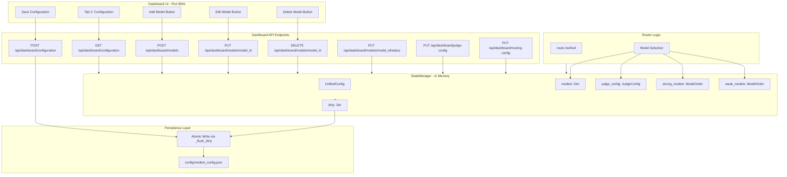

# Model Configuration Architecture Plan

## Overview

This document outlines the architecture for implementing full CRUD operations for model configuration through the dashboard UI, with proper persistence to application memory via the StateManager.

## Current State Analysis

### Existing Schema (config_models.py)

```python
ModelConfig:
  - display_name: str
  - provider: str
  - status: Literal["active", "inactive", "disabled"]
  - capabilities: ModelCapabilities
  - routing: RoutingConfig (priority_group, order)
  - limits: RateLimits (rpm, rpd, tpm)
  - pricing: PricingInfo (usage_tiers)
  - state: ModelState (runtime state)
```

### Required Schema (User Specification)

```
ModelConfig:
  - modelDefinition: str (model identifier/name)
  - modelName: str (display name)
  - modelKey: str (API key reference)
  - modelProvider: str
  - freeTierLimits: {rpd, rpm, tpm, tpd}
  - paidLimits: {rpd, rpm, tpm, tpd}
  - cost: {perCall, perToken: {input, output}}
  - status: ACTIVE | BANNED
  - statusValidTill: datetime (for BANNED status)

JudgeConfig:
  - modelOrder: [modelObjectId]
  - isJudgeRequired: bool

StrongModels:
  - modelOrder: [modelObjectId]

WeakModels:
  - modelOrder: [modelObjectId]
```

---

## Architecture Diagram



---

## Schema Changes

### 1. Extended ModelConfig

```python
class TierLimits(BaseModel):
    requests_per_day: int = 1500
    requests_per_minute: int = 15
    tokens_per_minute: int = 1_000_000
    tokens_per_day: int = 10_000_000

class CostInfo(BaseModel):
    per_call: float = 0.0
    input_per_million: float = 0.0
    output_per_million: float = 0.0

class ModelConfig(BaseModel):
    # Identity
    model_definition: str  # NEW: model identifier e.g. "gpt-4-turbo"
    display_name: str
    model_key: Optional[str] = None  # NEW: reference to API key env var
    provider: str
    
    # Status
    status: Literal["active", "banned", "disabled"] = "active"  # MODIFIED
    status_valid_till: Optional[datetime] = None  # NEW: for banned status
    
    # Capabilities
    capabilities: ModelCapabilities = Field(default_factory=ModelCapabilities)
    
    # Routing
    routing: RoutingConfig = Field(default_factory=RoutingConfig)
    
    # Rate Limits - Separated
    free_tier_limits: TierLimits = Field(default_factory=TierLimits)  # NEW
    paid_tier_limits: TierLimits = Field(default_factory=TierLimits)  # NEW
    
    # Cost
    cost: CostInfo = Field(default_factory=CostInfo)  # NEW structure
    
    # Runtime State
    state: ModelState = Field(default_factory=ModelState)
```

### 2. New JudgeConfig

```python
class JudgeConfig(BaseModel):
    model_order: List[str] = []  # List of model IDs in priority order
    is_judge_required: bool = True
    fallback_complexity: float = 0.5  # Default complexity if judge fails
```

### 3. New RoutingOrderConfig

```python
class RoutingOrderConfig(BaseModel):
    strong_models: List[str] = []  # Ordered list of strong model IDs
    weak_models: List[str] = []    # Ordered list of weak model IDs
```

### 4. Extended UnifiedConfig

```python
class UnifiedConfig(BaseModel):
    system_settings: SystemSettings = Field(default_factory=SystemSettings)
    models: Dict[str, ModelConfig] = Field(default_factory=dict)
    judge_config: JudgeConfig = Field(default_factory=JudgeConfig)  # NEW
    routing_order: RoutingOrderConfig = Field(default_factory=RoutingOrderConfig)  # NEW
```

---

## API Endpoints to Implement

### Model CRUD

| Method | Endpoint | Description |
|--------|----------|-------------|
| GET | /api/dashboard/models | List all models |
| GET | /api/dashboard/models/{model_id} | Get single model |
| POST | /api/dashboard/models | Create new model |
| PUT | /api/dashboard/models/{model_id} | Update model |
| DELETE | /api/dashboard/models/{model_id} | Delete model |
| PUT | /api/dashboard/models/{model_id}/status | Update status only |

### Judge Config

| Method | Endpoint | Description |
|--------|----------|-------------|
| GET | /api/dashboard/judge-config | Get judge configuration |
| PUT | /api/dashboard/judge-config | Update judge configuration |

### Routing Order

| Method | Endpoint | Description |
|--------|----------|-------------|
| GET | /api/dashboard/routing-order | Get model ordering |
| PUT | /api/dashboard/routing-order | Update model ordering |

### Configuration Save

| Method | Endpoint | Description |
|--------|----------|-------------|
| POST | /api/dashboard/configuration/save | Force persist to disk |
| POST | /api/dashboard/configuration/reload | Reload from disk |

---

## StateManager Changes

### New Methods Required

```python
class StateManager:
    # Existing methods...
    
    # NEW: Model CRUD
    async def add_model(self, model_id: str, config: ModelConfig) -> bool
    async def update_model_config(self, model_id: str, **updates) -> bool
    async def delete_model(self, model_id: str) -> bool
    
    # NEW: Status management
    async def ban_model(self, model_id: str, until: datetime) -> bool
    async def unban_model(self, model_id: str) -> bool
    async def is_model_banned(self, model_id: str) -> bool
    
    # NEW: Judge config
    async def get_judge_config(self) -> JudgeConfig
    async def update_judge_config(self, config: JudgeConfig) -> bool
    
    # NEW: Routing order
    async def get_routing_order(self) -> RoutingOrderConfig
    async def update_routing_order(self, config: RoutingOrderConfig) -> bool
    
    # NEW: Reload from disk
    async def reload_from_disk(self) -> bool
```

---

## Router Logic Changes

### Model Selection Update

The [`Router.route()`](sentinelrouter/sentinelrouter/router_logic.py:76) method needs to:

1. Check model `status` for `banned` and `status_valid_till`
2. Use `routing_order.strong_models` and `routing_order.weak_models` for ordering
3. Use `judge_config` for judge model selection
4. Use `free_tier_limits` vs `paid_tier_limits` based on usage

```python
# In Router.route() - Updated model selection logic
async def _get_candidate_models(self, priority_group: str) -> List[Tuple[str, ModelConfig]]:
    all_models = await self.state_manager.get_all_models()
    routing_order = await self.state_manager.get_routing_order()
    
    # Get ordered list based on priority group
    if priority_group == "strong_tier":
        order_list = routing_order.strong_models
    else:
        order_list = routing_order.weak_models
    
    candidates = []
    for model_id in order_list:
        if model_id not in all_models:
            continue
        config = all_models[model_id]
        
        # Check status
        if config.status == "banned":
            if config.status_valid_till and config.status_valid_till > datetime.utcnow():
                continue  # Still banned
            # Ban expired, should be auto-unbanned
        
        if config.status == "disabled":
            continue
            
        candidates.append((model_id, config))
    
    return candidates
```

---

## Unit Tests Required

### 1. test_dashboard_model_crud.py

```python
# Tests for dashboard API endpoints
- test_create_model_success
- test_create_model_duplicate_id
- test_create_model_invalid_schema
- test_update_model_success
- test_update_model_not_found
- test_delete_model_success
- test_delete_model_not_found
- test_update_model_status_to_banned
- test_update_model_status_to_active
- test_ban_expiry_auto_unban
```

### 2. test_state_manager_extended.py

```python
# Tests for new StateManager methods
- test_add_model
- test_add_model_duplicate
- test_update_model_config
- test_delete_model
- test_ban_model_with_expiry
- test_unban_model
- test_is_model_banned_with_expiry
- test_get_judge_config
- test_update_judge_config
- test_get_routing_order
- test_update_routing_order
- test_reload_from_disk
```

### 3. test_router_with_config.py

```python
# Tests for router using new config structure
- test_router_respects_banned_status
- test_router_respects_ban_expiry
- test_router_uses_strong_model_order
- test_router_uses_weak_model_order
- test_router_uses_judge_config
- test_router_free_tier_limits
- test_router_paid_tier_limits
```

---

## Implementation Order

1. **Phase 1: Schema Updates** (config_models.py)
   - Add new fields to ModelConfig
   - Add JudgeConfig model
   - Add RoutingOrderConfig model
   - Update UnifiedConfig

2. **Phase 2: StateManager Updates** (state_manager.py)
   - Add CRUD methods for models
   - Add status management methods
   - Add judge/routing config methods
   - Add reload_from_disk method

3. **Phase 3: Dashboard API** (dashboard.py)
   - Implement POST /api/dashboard/models
   - Implement PUT /api/dashboard/models/{id}
   - Implement DELETE /api/dashboard/models/{id}
   - Implement PUT /api/dashboard/models/{id}/status
   - Implement PUT /api/dashboard/judge-config
   - Implement PUT /api/dashboard/routing-order
   - Fix saveConfiguration() to actually persist

4. **Phase 4: Router Updates** (router_logic.py)
   - Update model selection to use new ordering
   - Add ban status checking with expiry
   - Update limit checking for free/paid tiers

5. **Phase 5: Unit Tests**
   - test_dashboard_model_crud.py
   - test_state_manager_extended.py
   - test_router_with_config.py

6. **Phase 6: Migration**
   - Script to migrate existing config to new schema
   - Update sample config file

---

## Sample Updated Config

```json
{
  "system_settings": {
    "persistence_interval_seconds": 5,
    "default_routing_strategy": "waterfall",
    "timezone": "UTC"
  },
  "judge_config": {
    "model_order": ["gemini-2.5-flash-lite", "gemini-2.5-flash"],
    "is_judge_required": true,
    "fallback_complexity": 0.5
  },
  "routing_order": {
    "strong_models": ["claude-3-opus-20240229"],
    "weak_models": ["deepseek-chat", "gemini-2.5-flash"]
  },
  "models": {
    "deepseek-chat": {
      "model_definition": "deepseek-chat",
      "display_name": "DeepSeek Chat",
      "model_key": "DEEPSEEK_API_KEY",
      "provider": "deepseek",
      "status": "active",
      "status_valid_till": null,
      "capabilities": {
        "modality": ["text"],
        "context_window": 128000
      },
      "routing": {
        "priority_group": "fast_tier",
        "order": 1
      },
      "free_tier_limits": {
        "requests_per_day": 1500,
        "requests_per_minute": 30,
        "tokens_per_minute": 2000000,
        "tokens_per_day": 50000000
      },
      "paid_tier_limits": {
        "requests_per_day": 10000,
        "requests_per_minute": 60,
        "tokens_per_minute": 4000000,
        "tokens_per_day": 100000000
      },
      "cost": {
        "per_call": 0.0,
        "input_per_million": 0.27,
        "output_per_million": 0.27
      },
      "state": {
        "current_rpm": 0,
        "requests_today": 0,
        "tokens_today": 0,
        "total_cost_session": 0.0,
        "last_updated_ts": null,
        "exhausted_until_ts": null
      }
    }
  }
}
```

---

## Data Flow Summary

```
Dashboard UI (Edit) 
    │
    ▼
PUT /api/dashboard/models/{id}
    │
    ▼
StateManager.update_model_config()
    │
    ├── Updates in-memory config
    ├── Marks model as dirty
    │
    ▼
Background Flush Task (every 5s)
    │
    ▼
_atomic_write() to models_config.json