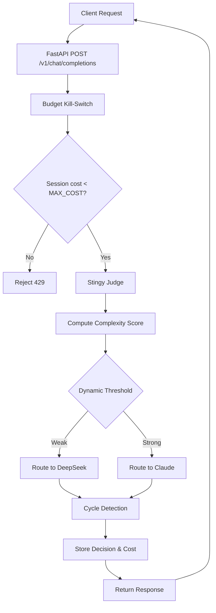

# SentinelRouter: Production-Ready Local API Gateway Design

## 1. Overview

SentinelRouter is a Python‑based local API gateway that sits between an autonomous agent (client) and LLM providers. Its primary purpose is to enforce strict budget control and intelligent routing between a weak model (DeepSeek) and a strong model (Anthropic Claude) based on request complexity, cumulative cost, and session‑based limits.

## 2. System Architecture

### 2.1 High‑Level Components

The system is built around four core modules (A–D) plus supporting infrastructure:

1. **Module A – Budget Kill‑Switch (Middleware)**  
   - Tracks cumulative cost per session (client‑defined session ID or IP‑based).
   - Rejects requests when `MAX_COST_PER_SESSION` is exceeded.
   - Uses SQLite for persistent cost logging.

2. **Module B – “Stingy” Judge & Categorizer**  
   - Employs a weak model (DeepSeek) to analyze the incoming prompt’s complexity.
   - Outputs a complexity score (0–1) and a recommended route (weak/strong).
   - Implements a lightweight classification to avoid unnecessary expensive calls.

3. **Module C – Dynamic Thresholding (5% Rule)**  
   - Adjusts the routing strictness based on the escalation rate (percentage of requests that are escalated to the strong model).
   - If the escalation rate exceeds 5%, the threshold for using the strong model is raised (making the router “stingier”).

4. **Module D – Graph‑Based Cycle Detection**  
   - Uses `networkx` to build a directed graph of request‑response semantic hashes.
   - Detects loops (identical or near‑identical requests within a session) and blocks repetitive cycles.

5. **Supporting Components**  
   - **FastAPI Application** – Serves the OpenAI‑compatible endpoint.
   - **SQLite Database** – Stores sessions, routing decisions, cost logs, and cycle hashes.
   - **Logging & Audit** – Structured JSON logs with request/response context.
   - **Docker Container** – Alpine‑based, resource‑limited (1 CPU, 512 MB RAM).

### 2.2 Component Interaction Flow



## 3. Database Schema (SQLite)

```sql
-- sessions table: tracks each client session and its budget
CREATE TABLE sessions (
    session_id TEXT PRIMARY KEY,
    client_ip TEXT,
    created_at TIMESTAMP DEFAULT CURRENT_TIMESTAMP,
    max_cost_per_session REAL DEFAULT 10.0,
    current_cost REAL DEFAULT 0.0,
    is_active BOOLEAN DEFAULT 1
);

-- routing_decisions table: audit trail of every request
CREATE TABLE routing_decisions (
    decision_id INTEGER PRIMARY KEY AUTOINCREMENT,
    session_id TEXT,
    request_id TEXT UNIQUE,
    timestamp TIMESTAMP DEFAULT CURRENT_TIMESTAMP,
    model_used TEXT,
    complexity_score REAL,
    cost_incurred REAL,
    prompt_hash TEXT,
    FOREIGN KEY (session_id) REFERENCES sessions (session_id)
);

-- cycle_detection table: semantic hashes for loop detection
CREATE TABLE cycle_detection (
    hash_id INTEGER PRIMARY KEY AUTOINCREMENT,
    session_id TEXT,
    prompt_hash TEXT,
    response_hash TEXT,
    timestamp TIMESTAMP,
    FOREIGN KEY (session_id) REFERENCES sessions (session_id)
);

-- escalation_log table: tracks threshold adjustments
CREATE TABLE escalation_log (
    log_id INTEGER PRIMARY KEY AUTOINCREMENT,
    session_id TEXT,
    escalation_rate REAL,
    threshold_before REAL,
    threshold_after REAL,
    changed_at TIMESTAMP DEFAULT CURRENT_TIMESTAMP
);
```

## 4. API Endpoint Specifications

### 4.1 Primary Endpoint

**POST** `/v1/chat/completions` – OpenAI‑compatible chat completion.

**Request:** Follows the standard OpenAI API format.

**Response:** Same as the chosen provider (DeepSeek or Claude) with added headers:

- `X-Sentinel-Model-Used`: Which model served the request.
- `X-Sentinel-Cost`: Cost incurred for this request.
- `X-Sentinel-Session-Cost`: Cumulative session cost so far.

### 4.2 Monitoring Endpoints (Internal)

- **GET** `/health` – Basic health check.
- **GET** `/metrics` – Prometheus‑style metrics (request counts, cost totals, escalation rate).
- **GET** `/audit/{session_id}` – Retrieve routing decisions for a session.

## 5. Class and Module Structure

```
sentinelrouter/
├── __init__.py
├── app.py                      # FastAPI app & route registration
├── middleware/
│   ├── __init__.py
│   ├── budget_kill_switch.py   # Module A
│   └── cycle_detection.py      # Module D
├── judge/
│   ├── __init__.py
│   ├── categorizer.py          # Module B
│   └── thresholding.py         # Module C
├── database/
│   ├── __init__.py
│   ├── models.py               # SQLAlchemy ORM models
│   └── crud.py                 # Database operations
├── clients/
│   ├── __init__.py
│   ├── deepseek_client.py
│   └── claude_client.py
├── logging/
│   ├── __init__.py
│   └── json_logger.py
└── config.py                   # Environment configuration
```

**Key Classes:**

- `BudgetKillSwitch`: Middleware that checks session cost against limit.
- `StingyJudge`: Uses the weak model to score complexity.
- `DynamicThreshold`: Adjusts routing threshold based on escalation rate.
- `CycleDetector`: Builds and analyzes request‑response graphs.
- `SessionManager`: CRUD for session and cost tracking.
- `DeepSeekClient` / `ClaudeClient`: Async clients for each provider.

## 6. Environment Configuration

The following environment variables are required:

```bash
# Provider API keys
DEEPSEEK_API_KEY=your_key
ANTHROPIC_API_KEY=your_key

# Budget & routing
MAX_COST_PER_SESSION=10.0
INITIAL_THRESHOLD=0.7
ESCALATION_RATE_LIMIT=0.05

# Database
DATABASE_PATH=/data/sentinelrouter.db

# Server
HOST=0.0.0.0
PORT=8000
LOG_LEVEL=INFO
```

A `config.py` module will load these with defaults and validate them.

## 7. Error Handling and Monitoring

- **Structured Logging:** Every request/response is logged as JSON for easy ingestion (e.g., into ELK or Loki).
- **Metrics:** Prometheus metrics exposed at `/metrics` (counters for requests, costs, escalations).
- **Alerts:** If the escalation rate exceeds 5% for three consecutive intervals, an alert is logged.
- **Graceful Degradation:** If the weak model fails, the system can fall back to the strong model (with cost tracking) or return a meaningful error.

## 8. Security Considerations

1. **API‑Key Protection:** Provider keys are stored as environment variables, never in code.
2. **Request Validation:** All incoming requests are validated against the OpenAI schema; malformed requests are rejected.
3. **Rate Limiting:** Per‑session rate limiting is applied alongside budget limits.
4. **Cycle Detection:** Prevents infinite loops caused by malformed agent prompts.
5. **Resource Limits:** The Docker container is limited to 1 CPU and 512 MB RAM to avoid resource exhaustion.
6. **Audit Trail:** Every routing decision is stored, enabling post‑incident analysis.

## 9. Deployment

A single Dockerfile builds the Alpine‑based image:

```dockerfile
FROM python:3.11‑alpine
WORKDIR /app
COPY requirements.txt .
RUN pip install --no‑cache‑dir -r requirements.txt
COPY . .
CMD ["uvicorn", "sentinelrouter.app:app", "--host", "0.0.0.0", "--port", "8000"]
```

**Docker Compose** example for local development with volume persistence for SQLite.

## 10. Testing Strategy

- **Unit Tests:** For each module (budget kill‑switch, judge, thresholding, cycle detection).
- **Integration Tests:** Verify the full routing flow with mocked provider APIs.
- **Load Tests:** Ensure the gateway can handle concurrent sessions under budget constraints.

## 11. Future Enhancements

- Support for additional LLM providers (OpenAI, Gemini, etc.).
- Real‑time dashboard for monitoring session costs and routing decisions.
- Machine‑learning‑based threshold adjustment (beyond the static 5% rule).

---

*This document serves as the authoritative design specification for the SentinelRouter project. Implementation should follow the structure and decisions outlined above.*