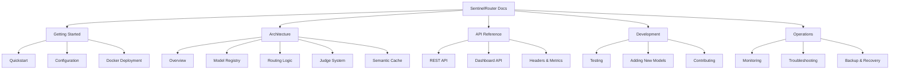

# SentinelRouter Documentation

Welcome to the SentinelRouter documentation. This is the central hub for all documentation related to the SentinelRouter project – a production‑ready local API gateway for budget‑controlled LLM routing.

## Documentation Map

## Quick Links

- **[Quickstart](getting-started/quickstart.md)** – Install and run your first request in 5 minutes.
- **[Configuration](getting-started/configuration.md)** – Environment variables, config schema, and model setup.
- **[Docker Deployment](getting-started/docker-deployment.md)** – Run SentinelRouter in production using Docker.
- **[Architecture Overview](architecture/overview.md)** – High‑level system design and component interaction.
- **[REST API](api-reference/rest-api.md)** – Endpoint specifications and examples.
- **[Dashboard](api-reference/dashboard-api.md)** – Real‑time monitoring and configuration UI.

## Documentation Structure

| Section | Description |
|---------|-------------|
| **Getting Started** | Installation, configuration, and first‑run guides for new users. |
| **Architecture** | Deep dives into system design, modules, and internal data flow. |
| **API Reference** | Detailed specifications for all public and internal APIs. |
| **Development** | Guides for extending the codebase, writing tests, and contributing. |
| **Operations** | Monitoring, troubleshooting, and maintaining a production deployment. |

## Versioning

This documentation corresponds to SentinelRouter **v1.0** (commit `[latest]`).  
For older versions, please refer to the Git history.

## Contributing to Documentation

Found an error or missing information? Please open an issue or submit a pull request.  
Documentation source files are located in the `documentation/` directory of the repository.

---

*Last Updated: December 14, 2025*  
*Maintainer: SentinelRouter Team*